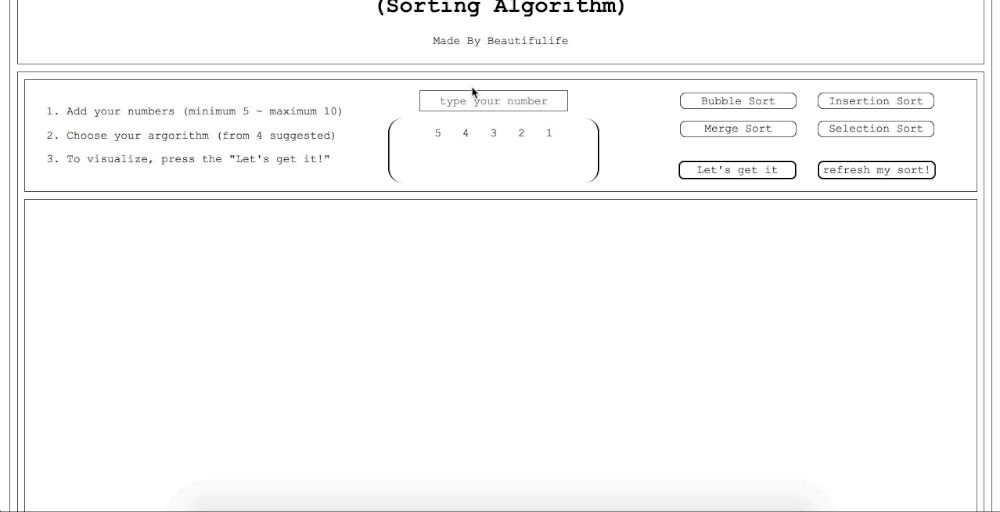
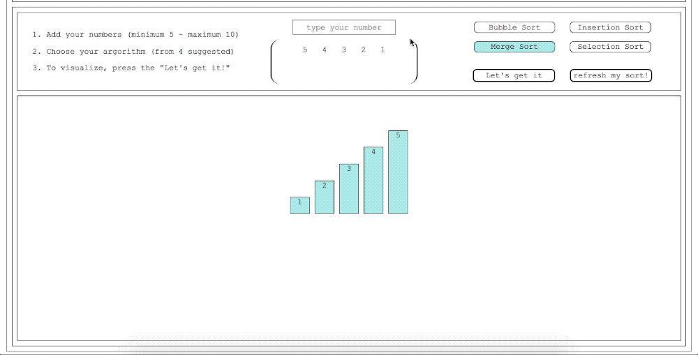
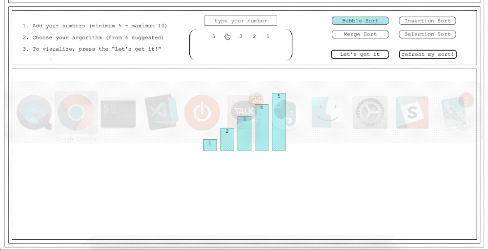
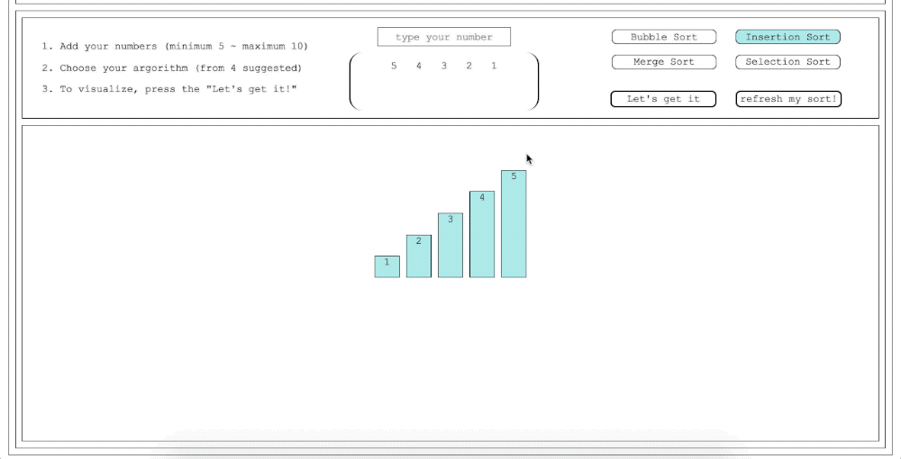
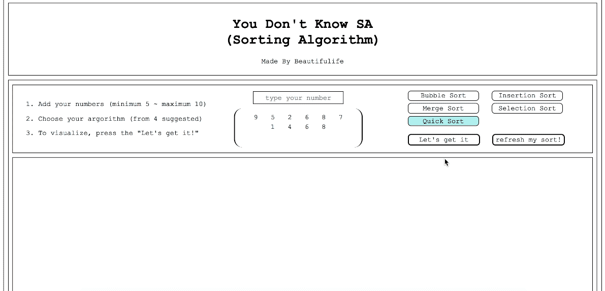

# Vanilla Sorting
5가지 정렬 알고리즘의 구동 방식을 웹으로 표현해내는 과제입니다.

### bubbleSort


### selectionSort


### insertionSort


### mergetSort


### quickSort



## Setup

Install dependencies

```sh
$ yarn install (or npm install)
```

## Development

```sh
$ yarn dev (or npm run dev)
# visit http://localhost:8080
```

## Features

* 5가지 정렬 알고리즘의 구동 방식을 시각적으로 확인할 수 있도록 표현
* 사용자가 "숫자"들을 최소 5개에서 최대 10개까지 선택할 수 있는 UI
* 숫자들을 입력한 후, 사용자가 원하는 정렬 방식을 선택
* 정렬 방식을 선택한 후, 실행할 수 있는 "실행" 버튼
* 숫자의 갯수가 충족되지 않았거나, 정렬 방식이 선택되지 않은 상황에서는 "실행"을 시킬 수 없음
* 숫자가 아닌 값은 받을 수 없음

### 정렬 알고리즘 종류

시간 복잡도 참고 링크: [Big-O Cheatsheet](http://bigocheatsheet.com/))

1. [Bubble Sort](https://en.wikipedia.org/wiki/Bubble_sort)
2. [Selection Sort](https://en.wikipedia.org/wiki/Selection_sort)
3. [Insertion Sort](https://en.wikipedia.org/wiki/Insertion_sort)
4. [Merge Sort](https://en.wikipedia.org/wiki/Merge_sort)
5. [Quick Sort](https://en.wikipedia.org/wiki/Quicksort)
